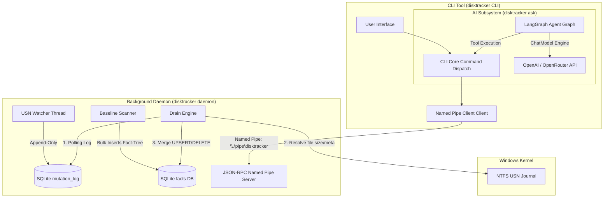

# 🔍 DiskTracker

Created by **[Pratham Parikh](https://github.com/pratham15541)**

[](https://github.com/pratham15541/disktracker)

[](https://github.com/pratham15541/disktracker)
[](LICENSE)
[](https://www.npmjs.com/package/disktracker)
[](https://community.chocolatey.org/packages/disktracker)
[](https://winstall.app/apps/pratham15541.disktracker)

**DiskTracker** is a high-performance, real-time Windows file-system observation daemon and an AI-driven CLI interface. 

Decoupled through a log-structured state machine model, it reads NTFS USN (Update Sequence Number) change logs to track volume modifications instantly without locking your drive or overloading system resources. Equipped with an LLM-driven LangGraph orchestration agent, you can query your disk status, find large files, track file mutation history, and manage space interactively using natural language.

---

## 💡 Why DiskTracker?

Traditional disk space analyzers crawl the file system from scratch every time they run. This is slow, resource-heavy, and doesn't tell you *when* or *how* your space is growing. 

DiskTracker resolves this by:
* **Instant Tracking**: Hooks into the NTFS USN Journal to catch every file creation, deletion, renaming, or modification in microseconds.
* **Append-Only Performance**: Real-time events are appended to a fast SQLite WAL-mode log (`mutation_log`) and processed by a background drain engine, preventing database locks and I/O bottlenecks.
* **Conversational Control**: Integrates an AI agent (`disktracker ask`) utilizing **LangGraph** to execute reads, diagnostics, and pruning actions safely under human approval.

---

## 🏗️ System Architecture

DiskTracker uses a log-structured state machine model to separate fast write paths from relational analysis:



1. **Baseline Scanner**: Walks the filesystem on startup (using fast Win32 directory APIs) to index initial facts.
2. **USN Watcher Thread**: Streams NTFS change events in real-time, instantly logging them into SQLite WAL.
3. **Drain Engine**: Replays mutation logs, queries file metadata, and merges state into the `facts` table (transitions from `BaselineScanning` -> `Reconciling` -> `Live`).
4. **AI Subsystem**: Combines a state graph with 12 built-in CLI and DB tools to allow conversational system diagnostics and file pruning.

---

## 📦 Installation

DiskTracker is built for Windows (x64 and ARM64). You can install it through several package managers or a standalone script.

### Method 1: Standalone Powershell (Recommended)
Open Command Prompt or PowerShell **as Administrator** and run:

```powershell
# Via PowerShell (Admin)
irm https://raw.githubusercontent.com/pratham15541/disktracker/main/install.ps1 | iex
```

### Method 2: NPM Package
```bash
npm install -g disktracker
```

### Method 3: Chocolatey
```bash
choco install disktracker
```

### Method 4: WinGet
```bash
winget install pratham15541.disktracker
```

---

## 🚀 CLI Usage Overview

Below is the quick reference card for DiskTracker commands.

| Command | Description |
|---|---|
| `disktracker init` | Starts/Registers the background daemon as a Windows Service and crawls baseline facts. |
| `disktracker status` | Queries the running daemon's status (PID, monitored volumes, and crawler phase). |
| `disktracker doctor` | Runs diagnostic health checks (database integrity, journaling state, permissions). |
| `disktracker search <query>` | Performs a substring search on the database with optional file size/time filtering. |
| `disktracker history [path]` | Displays file/directory mutation logs (Created, Modified, Deleted, Renamed). |
| `disktracker top` | Lists the largest files, folders, or directories ranking by growth or modifications (churn). |
| `disktracker snapshot create` | Takes a labeled snapshot of a volume's index state. |
| `disktracker snapshot diff <A> <B>` | Diffs two snapshots to show net files created, updated, or removed between time frames. |
| `disktracker ai config` | Configures your AI assistant API keys (OpenAI / OpenRouter base URL, API token). |
| `disktracker ask "<question>"` | Activates the LangGraph conversational agent to answer questions or prune folders. |
| `disktracker update` | Checks GitHub for the latest release, downloads the zip archive, and performs a zero-downtime binary swap. |
| `disktracker uninstall` | Stops the daemon service and deletes database logs. |

For detailed parameters and flags for each subcommand, read the [CLI Command Reference Card](docs/src/CLI_COMMANDS.md).

---

## 🤖 The AI Assistant (`disktracker ask`)

DiskTracker embeds an AI agent powered by **LangGraph** which operates as a ReAct (Reasoning and Acting) state machine. It is equipped with 12 tools to query and modify system state:

```text
               [User Input]
                    │
                    ▼
          ┌───────────────────┐
          │    Agent Node     │◄───────────────────┐
          └───────────────────┘                    │
                    │                              │
           [Tools Condition Check]                 │
                    │                              │
           Is tool needed?                         │
             /         \                           │
          (Yes)        (No)                        │
           /             \                         │
          ▼               ▼                        │
   ┌─────────────┐   ┌───────────────┐             │
   │ Tools Node  │   │ Final Answer  │             │
   └─────────────┘   └───────────────┘             │
          │                                        │
     [Runs Tool] ──────────────────────────────────┘
```

The agent is protected by **Human-In-The-Loop (HITL) gates**. If the AI tries to run a mutating command (such as deleting files or altering snapshots), the CLI pauses, displays the exact script to run, and asks for your explicit permission (`y/n`).

To read more about the agent tools, prompt structures, and configuration, see [AI Agent Guide](docs/src/AI_AGENT.md).

---

## 🎯 Next Goals

We plan to expand DiskTracker along these key vectors:

1. **Testing Suite Expansion**:
   - Write comprehensive E2E tests for the named pipe JSON-RPC interface.
   - Mock NTFS USN Journal logs to test edge cases in our state reducer / drain engine.
   - Run clippy, formatting, and unit tests under GitHub Actions (`ci.yml`) on every pull request.
2. **Cross-Platform Support**:
   - Extend the core platform traits with `platform-macos` utilizing Apple's **FSEvents** API.
   - Add `platform-linux` utilizing the Linux **inotify** system.
3. **GUI Desktop Client**:
   - Develop a modern, lightweight desktop interface built with Tauri and React.
   - Provide interactive sunburst charts, real-time file modification feeds, and visual timeline analysis.
