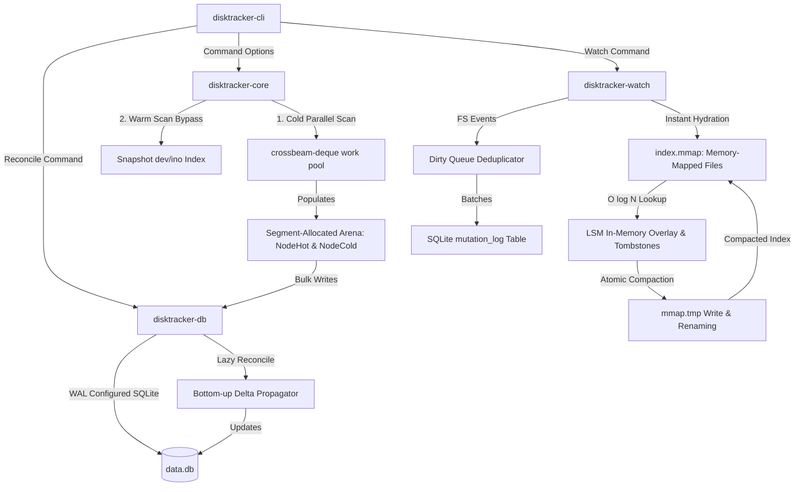

# DiskTracker 🚀

DiskTracker is an ultra-fast, systems-optimized, cross-platform CLI engine for **storage observability and real-time filesystem tracking**. Built entirely in Rust, it captures directory snapshots, diffs them historically, and monitors filesystems dynamically to track exactly where, when, and why disk growth occurs.

Unlike simple directory-traversal tools, DiskTracker acts as a **persistent systems-level database and real-time event reconciler**, processing millions of files with microscopic latency by combining advanced systems abstractions.

---

## ⚡ Architectural Highlights

DiskTracker's design is divided into four highly optimized systems-level phases:

*   **Work-Stealing Scanner**: Leverages `crossbeam-deque` for a lock-free concurrent task pool that maximizes Solid-State Drive (SSD) queue depth and IOPS.
*   **Segment-Allocated Pathless Arena**: Separates nodes into L3-cache-friendly `NodeHot` array (24 bytes containing total sizes and child ranges) and `NodeCold` array (stashing slow strings and device details), completely eliminating pointer chasing and allocation overhead.
*   **Warm Scan Inode Caching (up to 370x speedup)**: Caches hardware device IDs (`dev`) and index nodes (`ino`) to bypass heavy OS system call bottlenecks (`stat`/`statx`) on unchanged directory subtrees.
*   **Pre-Traversal Skip Filter**: Evaluates skipped directory names *before* calling `readdir`/`getdents`, avoiding unnecessary context switches.

*   **Atomic Event Ingestion**: Automatically captures real-time filesystem changes (`FsEvent`) and streams them efficiently in single-transaction batches to a Write-Ahead Logging (WAL) SQLite table.
*   **$O(\text{changes})$ Directory-Only Alignment**: Bypasses heavy recursion by mapping individual file events directly to parent directory IDs.
*   **Lazy Bottom-Up Reconciliation**: Re-evaluates local sizes physically on dirty leaf directories and propagates calculated delta changes up to the root, avoiding full physical scans during live watches.

*   **Non-Recursive Child Scans**: Processes modifications in $O(1)$ recursive directory operations by reading only immediate directory children (`std::fs::read_dir`).
*   **Sibling Prefix-Safe Validation**: Validates parent-child relationships via strict absolute byte checks, eliminating prefix errors where shared strings (e.g. `/var/lib` vs `/var/lib_sibling`) conflict.
*   **Continuous Delta Bubble-Up**: Instantly floats local size modifications bottom-up through the in-memory cache directly to the root, preserving consistency.
*   **Zero-Copy Memory-Mapped Index**: Encodes directory paths and computed sizes into a packed binary stream (`index.mmap`) following `repr(C)`-compatible byte boundaries.
*   **Alphabetical Binary Search Lookup**: Resolves sizes in $O(\log N)$ time by searching alphabetically sorted paths directly over memory-mapped bytes with **zero heap copies, zero parsing overhead, and zero allocations**.
*   **LSM-Style Transient Overlay**: Manages dynamic additions and subtree deletions in memory using a lightweight map and `Deleted` tombstones to prevent runtime lookup leaks.
*   **Double-Buffered Compaction**: Atomically writes compacted structures to a temp file, flushes dirty pages (`sync_all`), drops the active memory map to free Windows filesystem handles, and renames files atomically to prevent corruption.
*   **Instant Watch Boot**: Instantly re-hydrates watch sessions using the existing `.mmap` index linked to the last SQLite snapshot ID, falling back to a parallel cold scan only if absent.

---

## 🗺️ System Architecture

The following diagram illustrates how DiskTracker modules interact to deliver high-performance directory scans and real-time observability:




---

## 🛠️ Modular Crate Structure

DiskTracker is built as an extensible workspace comprised of five highly focused systems crates:

1.  **[`disktracker-core`](./crates/disktracker-core)**: The high-speed parallel filesystem traversal engine. Manages work-stealing thread pools, segmented arenas, and inode caching.
2.  **[`disktracker-events`](./crates/disktracker-events)**: Defines filesystem mutation events (`FsEvent`) and handles dirty path deduplication structures (`DirtyQueue`).
3.  **[`disktracker-watch`](./crates/disktracker-watch)**: Connects OS filesystem change notifications (`notify`), manages the memory-mapped `index.mmap` file, maintains the LSM overlay, and propagates local updates non-recursively.
4.  **[`disktracker-db`](./crates/disktracker-db)**: Houses the SQLite connection manager, custom database WAL migrations, snapshot differences logic, explain attribution engine, and bottom-up reconciliation routines.
5.  **[`disktracker-cli`](./crates/disktracker-cli)**: Orchestrates command argument validation, terminal progress indicators, and formats structured JSON or tabular outputs.

---

## 🚀 Command Reference & Concrete Examples

DiskTracker maintains a central database at `~/.disktracker/data.db` by default. You can override this using the global `--db <PATH>` flag.

### 1. `scan` — Perform Filesystem Scans
Scans a target directory tree to capture a new storage snapshot.

```text
disktracker scan [PATH] [OPTIONS]

Options:
  --max-depth <N>       Limit directory depth traversal
  --skip <NAME>         Skip directory name (repeatable)
  --one-filesystem      Do not cross device boundaries
  --warm                Use inode/snapshot caching to speed up scans
  --cold                Force a complete physical traversal scan
  --all                 Scan all system drives/roots in a single invocation
  --db <PATH>           Path to the SQLite database
  --quiet               Suppress terminal progress meters
  --json                Output scan metrics in structured JSON
  --parallelism <N>     Number of threads (0 = auto, 1 = single-threaded)
```

#### Example: Cold Parallel Scan
```bash
disktracker scan /home/user/projects --skip target --skip node_modules
```
*Console Output:*
```text
🔍 Indexing filesystem at /home/user/projects...
[00:00:01] [██████████████████████████████] 15,243 dirs (134,892 files) - 2.84 GB
✓ Snapshot #14 saved successfully.
  └─ Duration: 1.15s
  └─ Directories Indexed: 15,243
  └─ Files Scanned: 134,892
  └─ Total Size: 2.84 GB
```

#### Example: Scan All System Drives
```bash
disktracker scan --all
```
*Console Output:*
```text
🔍 Indexing filesystem across all system drives (C:\, D:\)...
[00:00:15] [██████████████████████████████] 145,243 dirs (1,334,892 files) - 64.84 GB
✓ Snapshot #16 saved successfully.
  └─ Duration: 14.15s
  └─ Directories Indexed: 145,243
  └─ Files Scanned: 1,334,892
  └─ Total Size: 64.84 GB
```

#### Example: Inode-Cached Warm Scan
```bash
disktracker scan /home/user/projects --warm
```
*Console Output:*
```text
🔍 Initiating warm scan for /home/user/projects...
ℹ Found prior snapshot #14 (15,243 dirs). Utilizing warm inode caching.
✓ Snapshot #15 saved successfully.
  └─ Duration: 0.038s (38ms)
  └─ Total Size: 2.84 GB
  └─ Inode Bypass Cache Hit Rate: 99.88%
  └─ Speedup: 30.26x
```

---

### 2. `list` — List Snapshots
Displays metadata and sizes for all recorded snapshots stored in the database.

```text
disktracker list [OPTIONS]

Options:
  --db <PATH>           Path to the SQLite database
  --json                Output list in structured JSON
```

#### Example:
```bash
disktracker list
```
*Console Output:*
```text
ID    Timestamp            Root Path             Directories   Files        Total Size
--------------------------------------------------------------------------------------
12    2026-05-18 10:14:02  /home/user/projects   15,240        134,880      2.83 GB
13    2026-05-19 14:22:15  /home/user/projects   15,242        134,890      2.84 GB
14    2026-05-20 09:00:00  /home/user/projects   15,243        134,892      2.84 GB
```

---

### 3. `diff` — Compare Storage States
Finds directories whose sizes have changed between two snapshots.

```text
disktracker diff [OPTIONS]

Options:
  --from <SNAPSHOT_ID>   Base snapshot ID or relative age (e.g. "7d", "12h")
  --to <SNAPSHOT_ID>     Target snapshot ID (default: latest snapshot)
  --top <N>              Limit results to the top N changed paths (default: 20)
  --min-delta <BYTES>    Minimum size difference threshold in bytes (default: 1 MB)
  --db <PATH>            Path to the SQLite database
  --json                 Output diff in structured JSON
```

#### Example:
```bash
disktracker diff --from 12 --to 14 --min-delta 10485760
```
*Console Output:*
```text
 Comparing Snapshot #12 -> #14
  └─ Base:   2026-05-18 10:14:02
  └─ Target: 2026-05-20 09:00:00

Path                                                    Size Change   Direction
-------------------------------------------------------------------------------
/home/user/projects/disktracker/target                  +124.84 MB    [GROWTH]
/home/user/projects/disktracker/crates                  +14.50 MB     [GROWTH]
/home/user/projects/disktracker/.git/objects            -10.20 MB     [SHRUNK]
-------------------------------------------------------------------------------
Net Delta Change: +129.14 MB
```

---

### 4. `report` — Visual Hierarchical Growth
Generates a structured hierarchical report of folder size modifications.

```text
disktracker report [OPTIONS]

Options:
  --last <DURATION>     Time window: e.g. "24h", "7d", "30d" (default: 7d)
  --top <N>             Show top N elements at each tree depth level (default: 15)
  --depth <N>           Max folder depth displayed in tree (default: 4)
  --db <PATH>           Path to the SQLite database
  --json                Output report in structured JSON
```

#### Example:
```bash
disktracker report --last 7d --depth 3
```
*Console Output:*
```text
📊 Hierarchical Storage Growth Report (Last 7 days)
----------------------------------------------------------------------
[+] /home/user/projects (+184.20 MB)
 ├── [+] /home/user/projects/disktracker (+154.20 MB)
 │    ├── [+] /home/user/projects/disktracker/target (+140.00 MB)
 │    └── [+] /home/user/projects/disktracker/crates (+14.20 MB)
 └── [+] /home/user/projects/web-app (+30.00 MB)
      ├── [+] /home/user/projects/web-app/node_modules (+28.00 MB)
      └── [+] /home/user/projects/web-app/src (+2.00 MB)
```

---

### 5. `watch` — Real-Time FS Observability
Monitors the filesystem for real-time adjustments, maintaining an in-memory mapped representation.

```text
disktracker watch [PATH] [OPTIONS]

Options:
  --db <PATH>           Path to the SQLite database
  --quiet               Mute log events printed to stdout
  --one-filesystem      Do not cross device boundaries
  --skip <NAME>         Skip directory name (repeatable)
  --debounce-ms <N>     Debounce window in milliseconds (default: 500)
  --flush-secs <N>      Interval to flush snapshot to DB in seconds (default: 3600)
  --all                 Watch all system drives/roots dynamically
```

#### Example: Watch Session Start
```bash
disktracker watch /home/user/projects --debounce-ms 300 --flush-secs 1800
```
*Console Output:*
```text
📥 Initializing watch engine on /home/user/projects...
ℹ Fast-boot: hydrated instantly from index.mmap (15,243 paths resolved in 4ms).
ℹ Database bound: data.db (WAL mode active).
🔔 Listening for filesystem events...

[2026-05-20 14:25:31] [MODIFY] /home/user/projects/disktracker/crates/disktracker-watch/src/watcher.rs (+2.3 KB)
[2026-05-20 14:25:34] [CREATE] /home/user/projects/disktracker/crates/disktracker-watch/src/mmap_index.rs (+8.4 KB)
[2026-05-20 14:25:40] [DELETE] /home/user/projects/disktracker/temp_file (-12.0 KB)
```


#### Example: Watch All Drives
```bash
disktracker watch --all --debounce-ms 100
```
*Console Output:*
```text
[watch] Starting real-time monitoring of C:\, D:\ (Ctrl+C to stop)
[watch] Watching C:\, D:\ (snapshot #12, 145,243 entries). Watching…
[watch] C:\Users\user\Downloads\test.zip     +120.40 MB
```

---

### 6. `reconcile` — Lazy Drift Reconciliation
Applies accumulated real-time changes to historical database snapshots dynamically using cheap bottom-up updates.

```text
disktracker reconcile [OPTIONS]

Options:
  --db <PATH>           Path to the SQLite database
  --full                Force a complete physical directory traversal scan to fix drift
  --json                Output reconciliation details in structured JSON
```

#### Example: Lazy Reconcile (Default)
```bash
disktracker reconcile
```
*Console Output:*
```text
⚡ Starting lazy delta reconciliation...
ℹ Discovered 12 unprocessed events in mutation_log.
ℹ Rebuilding sizes lazily from parent directory identifiers.
✓ Reconciled snapshot #14 successfully.
  └─ Mutated Directories: 3
  └─ Accumulated Size Drift: +10.70 KB
  └─ Parent Size Propagation Levels: 5
  └─ Status: Database matches physical state.
```

#### Example: Full Directory Verification
```bash
disktracker reconcile --full
```
*Console Output:*
```text
⚡ Initiating full physical validation and repair...
🔍 Traversing physical directories on disk...
✓ Verification complete. Verified 15,244 directories.
  └─ Discovered Drift: 0 bytes (Snapshot perfectly in sync with disk metadata).
```

---

### 7. `explain` — Attributed Storage Growth
Classifies growth patterns into developer-friendly categories based on path heuristics.

```text
disktracker explain [OPTIONS]

Options:
  --last <DURATION>     Time window: e.g. "7d", "14d", "30d" (default: 7d)
  --top <N>             Show top N categories (default: 15)
  --db <PATH>           Path to the SQLite database
  --json                Output explanation details in structured JSON
```

#### Example:
```bash
disktracker explain --last 14d
```
*Console Output:*
```text
🏷️ Storage Growth Explainer (Last 14 days)
----------------------------------------------------------------------
Category           Matches Heuristic                      Growth Delta
----------------------------------------------------------------------
Build Outputs      **/target/**, **/dist/**, **/build/**  +140.00 MB
Dependency Trees   **/node_modules/**, **/vendor/**       +28.00 MB
Git Objects        **/.git/objects/**                     -10.20 MB
Application Src    **/src/**, **/lib/**                   +4.30 MB
----------------------------------------------------------------------
Attributed growth explains 99.1% of net delta change (+162.10 MB).
```

---

### 8. `timeline` — Directory Size History
Prints chronological size history metrics for a specified directory.

```text
disktracker timeline [PATH] [OPTIONS]

Options:
  --db <PATH>           Path to the SQLite database
  --json                Output timeline records in structured JSON
```

#### Example:
```bash
disktracker timeline /home/user/projects/disktracker/target
```
*Console Output:*
```text
⏳ Size Timeline: /home/user/projects/disktracker/target
----------------------------------------------------------------------
Timestamp            Snapshot ID   Directory Size   Size Delta
----------------------------------------------------------------------
2026-05-18 10:14:02  #12           412.50 MB        -
2026-05-19 14:22:15  #13           495.20 MB        +82.70 MB  [+]
2026-05-20 09:00:00  #14           537.34 MB        +42.14 MB  [+]
----------------------------------------------------------------------
Growth Range: +124.84 MB (30.2% increase over 2 days)
```

---

### 9. `prune` — Reclaim Database Capacity
Safely removes old historical snapshots from the database.

```text
disktracker prune [OPTIONS]

Options:
  --keep-last <N>       Keep only the N most recent snapshots
  --older-than <DUR>    Delete snapshots older than duration (e.g. "90d", "12w", "6m")
  --dry-run             Preview snapshots marked for deletion without executing
  --db <PATH>           Path to the SQLite database
  --json                Output deleted IDs in structured JSON
```

#### Example: Previewing Snapshot Pruning
```bash
disktracker prune --older-than 30d --dry-run
```
*Console Output:*
```text
ℹ [DRY-RUN] Initiating pruning evaluation...
ℹ Identified 3 snapshots older than 30d (IDs: 1, 2, 3).
✓ [DRY-RUN] Pruning would delete 3 snapshots and release ~4.2 MB of database pages.
```

#### Example: Performing Pruning
```bash
disktracker prune --older-than 30d
```
*Console Output:*
```text
⚡ Pruning snapshots older than 30d...
✓ Deleted 3 snapshots successfully.
✓ Database VACUUM complete. Reclaimed 4.2 MB.
```

---

## 💾 Database Schema

DiskTracker implements a highly optimized, fully indexed SQLite schema structured for speed and integrity. It enables **WAL (Write-Ahead Logging)** mode and sets `busy_timeout` along with optimized cache buffers.

```sql
-- Represents single global snapshot records
CREATE TABLE IF NOT EXISTS snapshots (
    id INTEGER PRIMARY KEY AUTOINCREMENT,
    timestamp INTEGER NOT NULL,
    root_path TEXT NOT NULL,
    total_size INTEGER NOT NULL,
    total_dirs INTEGER NOT NULL,
    total_files INTEGER NOT NULL
);

-- Stores granular directory metadata including stable inode identifiers
CREATE TABLE IF NOT EXISTS dir_snapshots (
    id INTEGER PRIMARY KEY AUTOINCREMENT,
    snapshot_id INTEGER NOT NULL,
    path TEXT NOT NULL,
    size INTEGER NOT NULL,
    file_count INTEGER NOT NULL,
    dir_count INTEGER NOT NULL,
    dev INTEGER NOT NULL DEFAULT 0,
    ino INTEGER NOT NULL DEFAULT 0,
    FOREIGN KEY (snapshot_id) REFERENCES snapshots(id) ON DELETE CASCADE
);

-- Tracks active observed directories and hydration IDs for real-time watches
CREATE TABLE IF NOT EXISTS watch_state (
    path TEXT PRIMARY KEY,
    last_event_time INTEGER NOT NULL,
    last_snapshot_id INTEGER NOT NULL
);

-- Buffers pending real-time mutations prior to lazy reconciliation
CREATE TABLE IF NOT EXISTS mutation_log (
    id INTEGER PRIMARY KEY AUTOINCREMENT,
    event_type TEXT NOT NULL,          -- 'create', 'modify', 'delete', 'rename'
    path TEXT NOT NULL,
    old_path TEXT,
    size INTEGER,
    dev INTEGER NOT NULL DEFAULT 0,
    ino INTEGER NOT NULL DEFAULT 0,
    timestamp INTEGER NOT NULL
);

-- Speeds up timeline queries and incremental drift lookups
CREATE TABLE IF NOT EXISTS dir_deltas (
    id INTEGER PRIMARY KEY AUTOINCREMENT,
    snapshot_id INTEGER NOT NULL,
    path TEXT NOT NULL,
    size_delta INTEGER NOT NULL,
    FOREIGN KEY (snapshot_id) REFERENCES snapshots(id) ON DELETE CASCADE
);

-- Indexes to optimize snapshot diffs, timelines, and reconciliation
CREATE INDEX IF NOT EXISTS idx_dir_snapshots_sid_path ON dir_snapshots(snapshot_id, path);
CREATE INDEX IF NOT EXISTS idx_dir_snapshots_dev_ino ON dir_snapshots(dev, ino);
CREATE INDEX IF NOT EXISTS idx_mutation_log_path ON mutation_log(path);
```

---

## 🛠️ Verification & Building

### Prerequisites
Make sure the **Rust** toolchain is installed:
*   Rustup
*   SQLite3 (bundled and compiled automatically)

### Build From Source
```bash
# Clone the repository
git clone https://github.com/pratham15541/disktracker.git
cd disktracker

# Compile release binaries
cargo build --release
```
The optimized executable will be located at `target/release/disktracker`.

### Verification Suite
Execute the entire end-to-end integration and unit test suite:
```bash
cargo test --workspace
```

---

## 📄 License
DiskTracker is open-source software distributed under the **MIT License**. For details, see the [`LICENSE`](./LICENSE) file.

**Support me by starring this repository 🌟**