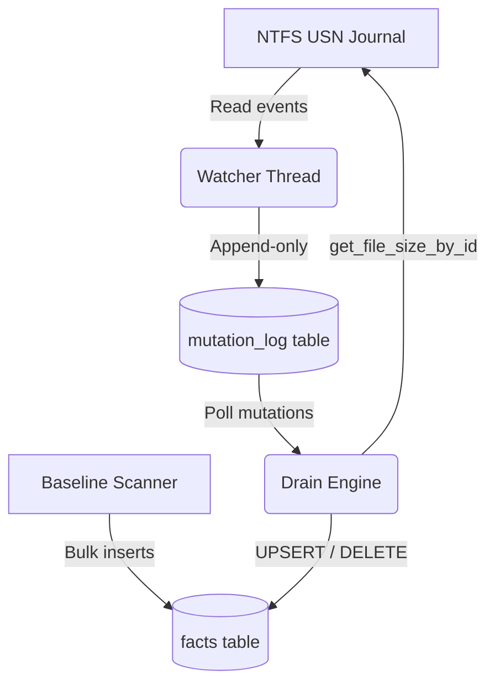

# DiskTracker — System Architecture & Design

DiskTracker is a high-performance, real-time Windows file-system change tracking utility. It uses a **Log-Structured State Machine** model to decouple fast filesystem events from slower relational database index updates.

---

## 1. Architectural Model

DiskTracker separates the **write path** (recording real-time events) from the **state reduction path** (calculating the current state of files on disk) to avoid database contention and lockouts.



1. **The Watcher (Append-Only Write):** Reads NTFS USN Journal records in real-time and appends them directly to the `mutation_log` table. This is extremely fast because it is append-only and requires no index lookups or path resolution.
2. **The Scanner (Baseline Crawl):** Walks the filesystem using optimized Win32 directory batch APIs, writing initial file entries directly into the `facts` table.
3. **The Drain Engine (State Reducer):** Polls the `mutation_log` table, resolves actual file sizes from the disk in real-time, and merges changes into the `facts` table (updates/deletes) to keep it in sync.

---

## 2. Codebase Organization

The codebase is organized into modular Rust crates to enforce separation of concerns and avoid circular dependencies:

```
disktracker/
├── apps/
│   └── cli/                # CLI frontend (init, status, doctor, uninstall) & Daemon launcher
└── crates/
    ├── core/               # Shared types, progress trackers, and global registry (core-types)
    ├── storage/            # SQLite connection caching, PRAGMAs, and table schemas
    ├── scanner/            # File walker orchestrator (handles WSL mock vs. Win32 calls)
    ├── platform/
    │   ├── traits/         # Platform abstraction interfaces (IpcListener, etc.)
    │   └── windows/        # Native Windows operations (USN watch, OpenFileById, Elevation checks)
    └── api/                # Named pipe server, JSON-RPC handler, and Drain Engine
```

### Crate Descriptions:
* **`disktracker` (apps/cli):** The main entrypoint. Handles user command parsing, starts the background daemon process, and queries daemon status over Named Pipes.
* **`core-types` (crates/core):** Owns all core data structures (`Fact`, `Mutation`, `RawEvent`) and progress tracking telemetry. Hosts a global static progress registry so the Scanner and Watcher can update progress in-memory without circular dependencies.
* **`storage` (crates/storage):** Manages SQLite connection pools and configures high-performance PRAGMAs (`journal_mode = WAL`, `synchronous = NORMAL`, `cache_size = -64000`, `foreign_keys = ON`).
* **`scanner` (crates/scanner):** Manages directory traversal. Uses native Windows batch walking on Windows, and falls back to mock tree generation on Linux/WSL.
* **`platform-windows` (crates/platform/windows):** Binds to Win32 APIs for elevated tasks: USN journal streaming, Admin check (`IsUserAnAdmin`), processes termination (`TerminateProcess`), and opening files by 64-bit ID (`OpenFileById`).
* **`api` (crates/api):** Runs the IPC Named Pipe server (`\\.\pipe\disktracker`) and orchestrates the background Drain Engines for each volume.

---

## 3. Threading & Lifecycle Gating Model

When the daemon starts up, it spawns three independent threads/tasks **per monitored volume** (e.g. `C:`, `D:`, `E:`). To prevent database contention and data loss, their start sequences are synchronized:

```
[Startup]
    │
    ├──> Query MAX(sequence) -> startup_seq
    │
    ├──> Spawn Thread B: Watcher (starts immediately from usn_start)
    │
    ├──> Spawn Thread A: Scanner (starts immediately, writes baseline to facts)
    │
    └──> Spawn Task C: Drain Engine (Blocked - state is BaselineScanning)
             │
             └──> Wait for Scanner completion...
                      │
                      ├──> Scanner completes
                      ├──> Transition state to "Reconciling"
                      │
                      └──> Drain Engine wakes up:
                               │
                               ├──> Replay all mutations > last_sequence (including crawl overlap)
                               ├──> Caught up with log!
                               └──> Transition state to "Live" (Continuous polling every 500ms)
```

1. **Gating (State: `BaselineScanning`):** The Drain Engine remains completely idle while the Scanner is executing its crawl. This prevents the Scanner from overwriting newer updates with stale baseline facts.
2. **Reconciliation (State: `Reconciling`):** Once the Scanner finishes, the Drain Engine wakes up and replays mutations starting from the recorded `last_sequence` (or `startup_seq` if it is a first run). This replays all edits that occurred *during* the crawl (the overlap window).
3. **Steady State (State: `Live`):** After catching up, the Drain Engine transitions to `Live` state, waking up every 500ms to poll and merge incoming file modifications.

---

## 4. SQLite Schema Design

SQLite operates in **WAL (Write-Ahead Log)** mode, enabling lock-free concurrent reads and writes.

### A. The `facts` Table
Stores the current, reduced state of all files and directories.
```sql
CREATE TABLE facts (
    volume TEXT NOT NULL,
    file_id INTEGER NOT NULL,
    parent_file_id INTEGER NOT NULL,
    name TEXT NOT NULL,
    is_directory INTEGER NOT NULL,
    size INTEGER NOT NULL,
    created_at TEXT NOT NULL,
    modified_at TEXT NOT NULL,
    PRIMARY KEY (volume, file_id),
    FOREIGN KEY(volume, parent_file_id) REFERENCES facts(volume, file_id)
);
```

### B. The `mutation_log` Table
Stores the append-only journal of filesystem changes.
```sql
CREATE TABLE mutation_log (
    sequence INTEGER PRIMARY KEY AUTOINCREMENT,
    volume TEXT NOT NULL,
    file_id INTEGER NOT NULL,
    parent_file_id INTEGER NOT NULL,
    name TEXT NOT NULL,
    kind TEXT NOT NULL,
    is_directory INTEGER NOT NULL,
    size_delta INTEGER NOT NULL,
    at TEXT NOT NULL,
    source TEXT NOT NULL
);
```

### C. The `drain_state` Table
Persists the progress of the Drain Engine to allow clean recovery across restarts.
```sql
CREATE TABLE drain_state (
    volume TEXT PRIMARY KEY,
    last_sequence INTEGER NOT NULL
);
```
