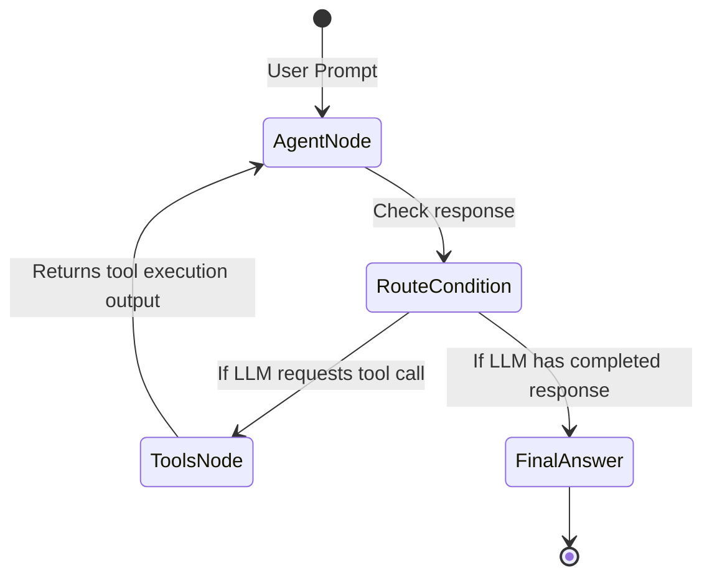

# 🤖 DiskTracker AI Orchestrator & LangGraph Integration

DiskTracker integrates an advanced, local LLM-driven AI agent that can converse about your file system state. Built using **LangGraph**, it enables structured reasoning (via LLMs) combined with deterministic tool execution.

---

## 1. Graph State Machine Architecture

The AI subsystem operates as a ReAct (Reasoning and Acting) state machine. It coordinates conversational turns and tool invocations:



1. **Agent Node**: Formulates a plan based on the conversation history and prompt. It decides whether it has enough information to answer or if it needs to query the system using a tool.
2. **Conditional Routing**: Inspects the assistant's message. If tool calls are requested, it routes execution to the `Tools Node`. Otherwise, it outputs the final response.
3. **Tools Node**: Resolves tool parameters, executes the requested system or database tool locally, appends the tool results as a `ToolMessage` to the graph state, and loops back to the `Agent Node`.

---

## 2. Human-in-the-Loop (HITL) Safety Gates

For safety, tools are classified into **Passive (Read-Only)** and **Active (Mutating)**:
* **Passive Tools** (e.g. searching the database, checking disk space, running diagnostic commands) execute immediately and transparently.
* **Active Tools** (e.g. deleting files, compressing snapshots, altering configurations) require elevated permissions. 
  - If the agent attempts a mutating action, the execution pauses.
  - The CLI displays the exact command to be executed.
  - The user is prompted for approval: `Do you want to run this command? (y/n)`.
  - If rejected, a warning is returned to the LLM, and the operation is aborted.

---

## 3. Built-In Local System Tools

The agent has access to 12 specialized tools to query or interact with your system:

| Tool Name | Type | Description | Parameters |
|---|---|---|---|
| `disktracker_search` | Passive | Searches indexed files (exact substring by default). `advanced` enables multi-tier scoring; `fuzzy` enables typo-tolerant matching (also enables advanced). | `query` (string), `path` (string), `ext` (string), `min_size` (int), `max_size` (int), `modified_after` (string), `modified_before` (string), `advanced` (bool), `fuzzy` (bool), `limit` (int) |
| `disktracker_history` | Passive | Queries mutation history. Created/Deleted/Renamed always shown (incl. 0B); Modified only if `|size_delta| >= 2`. Aggregates consecutive identical Created/Deleted/Renamed rows. | `path` (string), `since` (string), `until` (string), `kind` (string), `collapse` (bool), `limit` (int) |
| `disktracker_top` | Passive | Ranks by size, growth, or churn. Growth: 0B create/delete can appear; tiny non-zero growth under 2B is hidden. | `path` (string), `volume` (string), `folders` (bool), `files` (bool), `since` (string), `between_a` (string), `between_b` (string), `growth` (bool), `churn` (bool), `limit` (int) |
| `sqlite_read_query` | Passive | Runs arbitrary read-only SQL queries directly against the index database. | `query` (string) |
| `cli_read_command` | Passive | Runs safe, read-only system shell commands (e.g. `dir`, `df`, `cat`) to verify OS state. | `command` (string) |
| `disktracker_status` | Passive | Queries the status of the local DiskTracker daemon and active volumes. | (none) |
| `disktracker_doctor` | Passive | Diagnoses database health and recent operations logs. | (none) |
| `disktracker_snapshot_list`| Passive | Lists saved snapshots in the database. | `volume` (string), `limit` (int) |
| `disktracker_snapshot_diff` | Passive | Diffs files between two snapshots. Created/Deleted/Renamed always shown (incl. 0B); Modified only if `|size_delta| >= 2`. | `snapshot_a` (string), `snapshot_b` (string), `path` (string), `limit` (int) |
| `fetch_signature` | Passive | Resolves heuristics and signatures for directories or executables (e.g. `System32`, `Temp`).| `target` (string) |
| `cli_write_command` | **Active** | Executes a file-mutating OS command (e.g. `rm`, `del`, `erase`). *Triggers HITL prompt.* | `command` (string) |
| `snapshot_manage` | **Active** | Deletes or compresses a saved snapshot. *Triggers HITL prompt.* | `action` (string), `label` (string) |

---

## 4. Configuration and Credentials

Credentials and API keys are stored securely using **Windows Credential Manager** via the `keyring` crate. They are never saved in plain text files.

### Set up OpenAI/OpenRouter connection:
```bash
# Configure endpoint base URL
disktracker ai config --base-url "https://openrouter.ai/api/v1"

# Set model name
disktracker ai config --model "meta-llama/llama-3-70b-instruct"

# Commit API token securely
disktracker ai config --api-key "your-api-key-here"
```

### Test API Handshake
Verify that DiskTracker can communicate with your LLM provider:
```bash
disktracker ai test
```

### Conversational Session History
You can manage and view previous conversational sessions:
```bash
# List all saved sessions
disktracker ai session list

# Show the full chat transcript of a session
disktracker ai session show <session-id>
```
