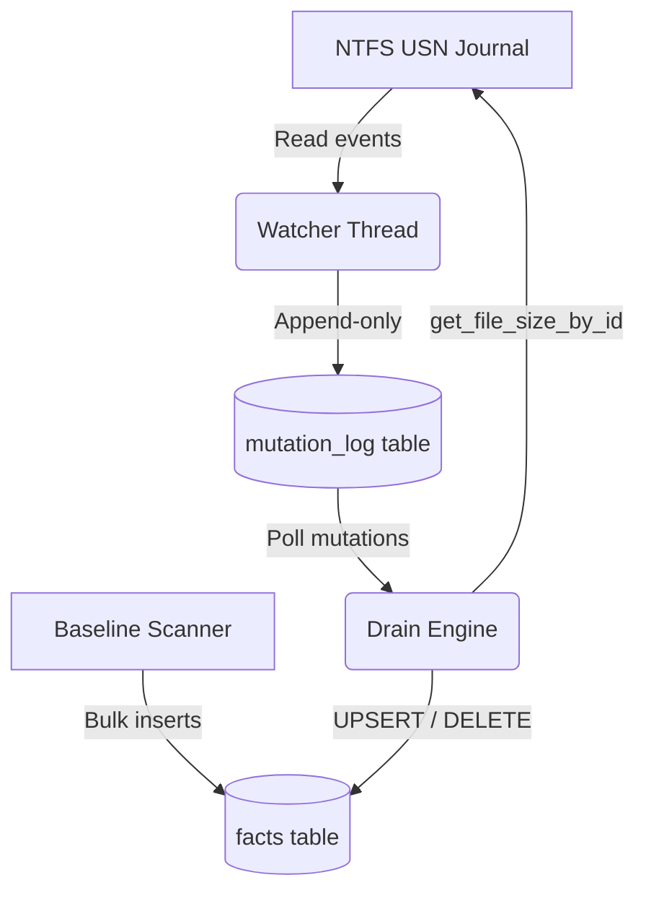
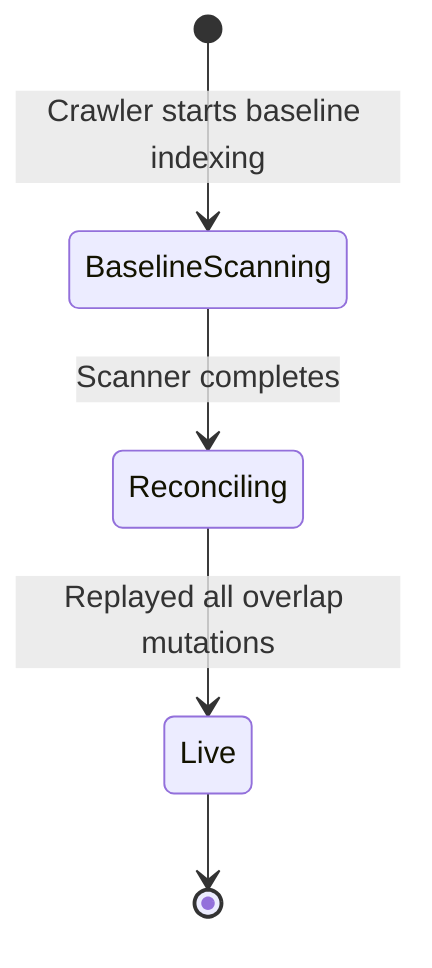

# DiskTracker — System Architecture & Design

DiskTracker is a high-performance, real-time Windows file-system observation utility. It decouples fast filesystem events from slower relational database index updates using a **Log-Structured State Machine** model.

---

## 1. Core Decoupling Model (Log-Structured State Machine)

To track every file write on a system without causing database lockouts or high I/O latency, DiskTracker separates the **Write Path** (streaming filesystem events) from the **State Reduction Path** (computing the factual current layout of the disk).



* **Why decouple?** Direct updates (e.g. executing `UPDATE facts SET size = N WHERE file_id = X`) for every file operation in real-time would create massive lock contention on SQLite, blocking reads and slowing down the OS.
* **The Solution**: 
  - The **Watcher** streams USN records and executes simple, unindexed, append-only `INSERT INTO mutation_log` statements. This is extremely fast (sub-millisecond) and operates lock-free in SQLite **WAL (Write-Ahead Log)** mode.
  - The **Drain Engine** runs as a background worker task, pulling batches from `mutation_log` periodically, resolving file metadata (sizes/paths), and applying consolidated updates (`UPSERT` / `DELETE`) to the `facts` projection table.

---

## 2. Watched/Observation Layer & NTFS USN Algorithm

The Windows observation layer binds to the native NTFS Change Journal. The NTFS file system maintains an internal database called the **USN (Update Sequence Number) Journal**. Every change to a file or directory is recorded here with a unique sequence number.

### A. Journal Reading Algorithm
DiskTracker opens the volume handle (e.g., `\\.\C:`) with `GENERIC_READ | GENERIC_WRITE` permissions and queries/reads journal records using Win32 `DeviceIoControl` APIs:
1. **Query Journal**: Uses control code `FSCTL_QUERY_USN_JOURNAL` to get the current journal parameters (e.g., `NextUsn`, `FirstUsn`, `MaxUsn`).
2. **Read Records**: Uses control code `FSCTL_READ_USN_JOURNAL` in a polling/waiting loop. It passes a `READ_USN_JOURNAL_DATA_V0` configuration struct specifying the starting USN cursor (`StartUsn`), reason masks, and the journal ID.

### B. USN Record Parsing
The memory block returned by `FSCTL_READ_USN_JOURNAL` is aligned and parsed into native `USN_RECORD_V2` (or V3) structures:

| Field Name | Type | Description |
|---|---|---|
| `RecordLength` | `u32` | Total length of the record (used to step to the next record in the memory buffer). |
| `MajorVersion` / `MinorVersion` | `u16` | Version of the USN structure (DiskTracker handles v2 and v3). |
| `FileReferenceNumber` | `u64` | The 64-bit NTFS index identifier for the file (invariant across renames/moves). |
| `ParentFileReferenceNumber`| `u64` | The 64-bit NTFS index identifier for the parent directory. |
| `Usn` | `i64` | The 64-bit Update Sequence Number assigned to this specific change. |
| `Reason` | `u32` | Bitflags representing the reason for the change (e.g. data write, rename, deletion). |
| `FileNameLength` | `u16` | Length of the file/folder name in bytes. |
| `FileNameOffset` | `u16` | Memory offset in the record structure pointing to the UTF-16 encoded filename. |

### C. Mapping USN Reason Flags
The watcher maps NTFS reason bitflags to DiskTracker mutations:
* `USN_REASON_FILE_CREATE` ──► `Created`
* `USN_REASON_DATA_OVERWRITE` | `USN_REASON_DATA_EXTEND` | `USN_REASON_BASIC_INFO_CHANGE` ──► `Modified`
* `USN_REASON_RENAME_OLD_NAME` | `USN_REASON_RENAME_NEW_NAME` ──► `Renamed`
* `USN_REASON_FILE_DELETE` | `USN_REASON_CLOSE` ──► `Deleted`

---

## 3. The Drain Engine & State Reduction Algorithm

Decoupling introduces a classic concurrency challenge: **how to initialize the database with a baseline scan while concurrently capturing real-time updates?** DiskTracker solves this through a **State Gating Synchronization Protocol**.

### A. Lifecycle State Transitions

Each volume progress moves through three phases:



1. **BaselineScanning (State 1)**:
   - The **Watcher** starts immediately. It queries the current NTFS USN cursor (`startup_usn`) and starts streaming real-time writes into `mutation_log`.
   - Concurrently, the **Scanner** begins walking the directory tree, writing the initial file state into the `facts` table.
   - The **Drain Engine** is completely blocked (gated) during this crawl to prevent it from updating file sizes/paths in the database that the Scanner has not yet indexed.
2. **Reconciling (State 2)**:
   - The Scanner completes and records its end timestamp.
   - The **Drain Engine** wakes up. It reads the `drain_state` (which records the sequence cursor) and begins processing all entries in the `mutation_log` where `sequence > last_sequence`.
   - This phase replays all modifications that occurred *during* the scanner crawl (the overlap window), ensuring that any new modifications override old baseline values.
3. **Live (State 3)**:
   - Once the Drain Engine has processed all logs up to the latest sequence, it transitions to `Live`.
   - It polls the `mutation_log` every 500ms, immediately applying incoming file edits to the `facts` database.

### B. State Reduction Math
For each processed mutation log item, the Drain Engine performs a state reduction on the `facts` projection:
* **`Created` / `Modified`**:
  - Open file handle by 64-bit NTFS identifier (`OpenFileById`) using `platform_windows::open_file_by_id`. This is incredibly fast because it accesses the file directly through NTFS index lookups, bypassing slow string path resolutions.
  - Query file size and modification timestamps from the handle.
  - Execute an `UPSERT` on the `facts` table:
    ```sql
    INSERT INTO facts (volume, file_id, parent_file_id, name, is_directory, size, created_at, modified_at)
    VALUES (?1, ?2, ?3, ?4, ?5, ?6, ?7, ?8)
    ON CONFLICT(volume, file_id) DO UPDATE SET
      parent_file_id = excluded.parent_file_id,
      name = excluded.name,
      size = excluded.size,
      modified_at = excluded.modified_at;
    ```
* **`Renamed`**:
  - Update `name` and `parent_file_id` for the matching `file_id`.
* **`Deleted`**:
  - Run a recursive delete to remove the file and any child directories:
    ```sql
    DELETE FROM facts WHERE volume = ?1 AND file_id = ?2;
    ```

---

## 4. Named Pipe IPC Architecture

The CLI frontend interacts with the background daemon over Windows Named Pipes:
* **Endpoint**: `\\.\pipe\disktracker`
* **Protocol**: JSON-RPC 2.0.
* **Server Implementation**: Binds using Win32 named pipe APIs (`CreateNamedPipeW`, `ConnectNamedPipe`). Spawns a dedicated connection handler thread per connected CLI client.
* **Client Implementation**: CLI commands send requests (e.g. `{"jsonrpc": "2.0", "method": "status", "id": 1}`) and read structured responses.

---

## 5. AI Reasoning & Graph Tools

The AI assistant utilizes a LangGraph orchestrator to solve questions using the **ReAct (Reasoning and Acting)** loop pattern.

### A. Graph Loop Optimization
Instead of passing raw directories list to the LLM (which would exceed token limits), the agent uses specialized local system tools:
- **`disktracker_top` (Size & Growth rollups)**: Solves the space analysis problem using a recursive SQL rollup query.
  ```sql
  -- High-speed recursive CTE to calculate directory sizing
  WITH RECURSIVE FolderHierarchy(file_id, size) AS (
      SELECT parent_file_id, size FROM facts WHERE is_directory = 0
      UNION ALL
      SELECT f.parent_file_id, fh.size
      FROM facts f
      JOIN FolderHierarchy fh ON f.file_id = fh.file_id
      WHERE f.is_directory = 1 AND f.parent_file_id != 0
  )
  SELECT file_id, SUM(size) as total_size FROM FolderHierarchy GROUP BY file_id;
  ```
- **`disktracker_search`**: Utilizes SQLite indexes or Tantivy search indices to solve substring filename lookups instantly.
- **`sqlite_read_query`**: Lets the LLM execute arbitrary `SELECT` queries to find specific files, installations, or logs using standard SQL patterns.

---

## 6. SQLite Performance Tuning (WAL Engine)

SQLite is tuned for maximum concurrent performance:
* **WAL Mode (`journal_mode = WAL`)**: Enables readers (CLI search/status) to query the database concurrently without blocking or being blocked by the writer (Drain Engine / Watcher).
* **Normal Synchronization (`synchronous = NORMAL`)**: The database engine syncs logs to disk at critical checkpoints, reducing disk write wear and maximizing write speed.
* **High Cache Size (`cache_size = -64000`)**: Keeps 64MB of database pages in-memory to cache queries and avoid filesystem read calls.

---

## 7. Algorithms & Core Logic

DiskTracker resolves core filesystem challenges using specialized, high-performance algorithms:

### A. Variable-Length USN Memory Parsing
Because NTFS USN records vary in length due to custom filename lengths, the Watcher streams the change journal into a raw memory buffer and walks it using record offset math:
$$\text{offset}_{next} = \text{offset}_{current} + \text{record}.\text{RecordLength}$$
The watcher uses bitwise reason masks to ignore intermediate updates, processing the file changes only when the file handles are closed:
```rust
if (reason & USN_REASON_CLOSE) != 0 {
    // Process the final state change
}
```

### B. Directory Crawler (Scanner) & Transaction Writing
To index large drives under a minute without blocking the system, the Scanner crawls directories using Win32 batch walking APIs (`FindFirstFileW`/`FindNextFileW`) and aggregates write queries:
- **Batching Transactions**: Instead of executing an SQL insert for every single file found, the crawler accumulates files and writes them in batches of 1,000 files inside a single transaction (`BEGIN TRANSACTION ... COMMIT`). This reduces disk sync write commits from 1,000 to 1, speeding up baseline crawlers by up to 25x.

### C. Overlap Change Reconciliation
If a file is scanned at $T_1$, and a user writes to that same file at $T_2$ (while the scanner is still crawling the rest of the disk), the baseline index values could overwrite the new change.
DiskTracker resolves this overlap:
1. The **Watcher** records the write event at $T_2$ in the `mutation_log` table.
2. Once the crawler is complete, the **Drain Engine** reconciles the state.
3. For every log item, it opens the file directly via its 64-bit NTFS index identifier (`OpenFileById`). This is an $O(1)$ Win32 pointer call that bypasses slow string parent-path resolution.
4. It queries the current size and modifies the `facts` table using `UPSERT`, ensuring that the final database state reflects the most up-to-date physical size on the disk.

### D. Recursive CTE Size Rollups
Aggregating the sizing sums of deeply nested directories in relational databases is computationally expensive. DiskTracker implements a leaf-to-root recursive Common Table Expression (CTE) to sum up directories sizes:
1. It selects all files where `is_directory = 0` as the anchor.
2. It recursively queries up the directory tree by matching child parent IDs to their parent folders.
3. It groups the results by parent folder ID, executing high-speed memory sums that compute complete drive hierarchies in milliseconds.
